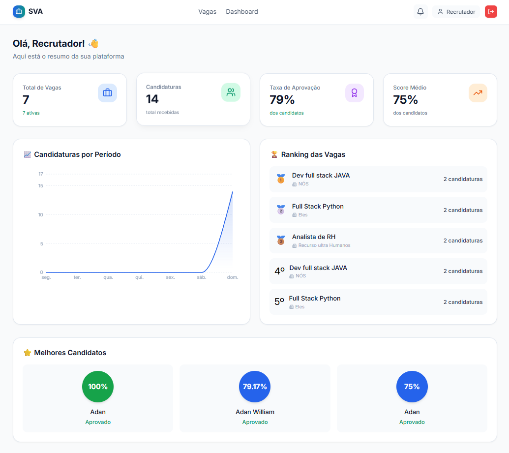
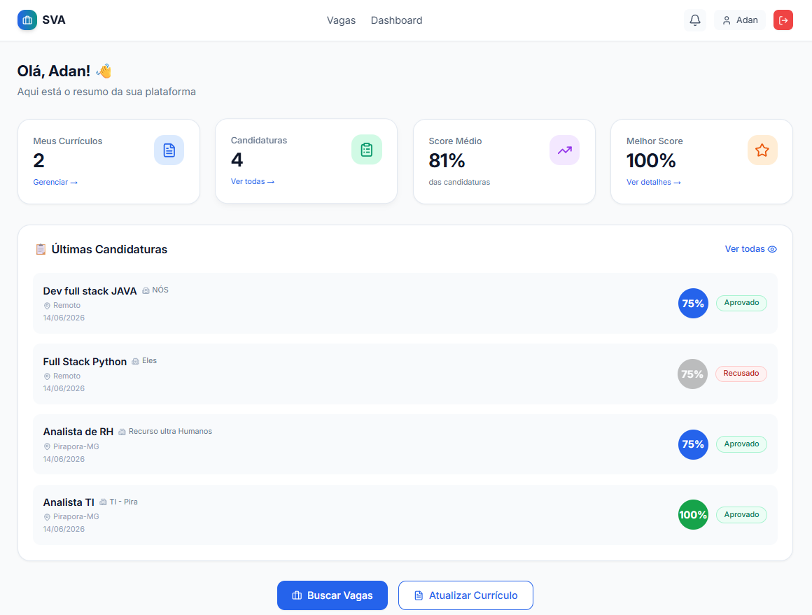

<div align="center">

# 🚀 SVA Platform

### Plataforma inteligente de recrutamento e seleção

Sistema Full Stack desenvolvido com **FastAPI**, **React** e **Inteligência Artificial** para conectar candidatos e recrutadores através de análise de compatibilidade entre perfis e vagas.


</div>

---

## ✨ Principais Recursos

* Dashboard analítico para recrutadores
* Sistema de vagas e candidaturas
* Gestão de currículos
* Ranking automático de candidatos
* Score de compatibilidade baseado em IA
* Recomendação de vagas para candidatos
* Interface moderna e responsiva

---

## 🖼️ Preview

### Dashboard Recrutador



### Dashboard Candidatos



---

## 🛠️ Stack Tecnológica

### Backend

* FastAPI
* SQLAlchemy
* SQLite
* JWT Authentication
* Scikit-Learn

### Frontend

* React
* TailwindCSS
* Axios
* Recharts

---

## 🚀 Executando Localmente

```bash
git clone https://github.com/adanwilliamdev/sva-platform.git
cd sva-platform
```

### Backend

```bash
cd backend

python -m venv venv
venv\Scripts\activate

pip install -r requirements.txt

uvicorn app.main:app --reload
```

### Frontend

```bash
cd frontend

npm install
npm start
```

---

## 🎯 Objetivo

O SVA Platform foi criado para demonstrar competências em:

* Desenvolvimento Full Stack
* Arquitetura de APIs REST
* Integração Frontend + Backend
* Autenticação JWT
* Banco de Dados Relacional
* Inteligência Artificial aplicada ao recrutamento
* Visualização de dados

---

## 🗺️ Roadmap

* Upload de currículos PDF
* Notificações por e-mail
* Integração com LinkedIn
* Modo escuro
* Aplicativo mobile

---

## 👨‍💻 Autor

**Adan William**

GitHub: @adanwilliamdev

---

<div align="center">

⭐ Se gostou do projeto, considere deixar uma estrela.

</div>
